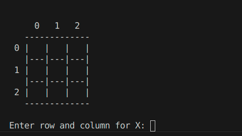
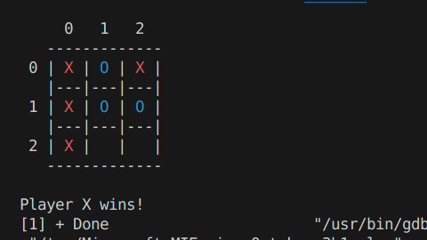

# Tic Tac Toe
This project is a simple implementation of the classic Tic-Tac-Toe game in C. The game is played between two players, with one player being X and the other O. The objective of the game is to be the first player to get three of their marks in a row (horizontally, vertically, or diagonally) on a 3x3 grid.

# Demo





## Installation

1. **Clone the Repository:**

    ```bash
    git clone https://github.com/your-username/tic-tac-toe-c.git
    cd tic-tac-toe-c
    ```

2. **Compile the Program:**

    Use a C compiler like `gcc` to compile the code:

    ```bash
    gcc -o tic_tac_toe main.c
    ```

3. **Run the Game:**

    Execute the compiled program:

    ```bash
    ./tic_tac_toe
    ```
    
# Code Structure
- main.c: The main entry point of the program, containing the game loop and the main logic.
Functions:
- setupBoard(): Initializes the game board.
- displayBoard(): Displays the current state of the game board.
- playerMove(): Handles player input and updates the game board.
- checkWinner(): Checks if there's a winner.
- checkDraw(): Checks if the game is a draw.

  
